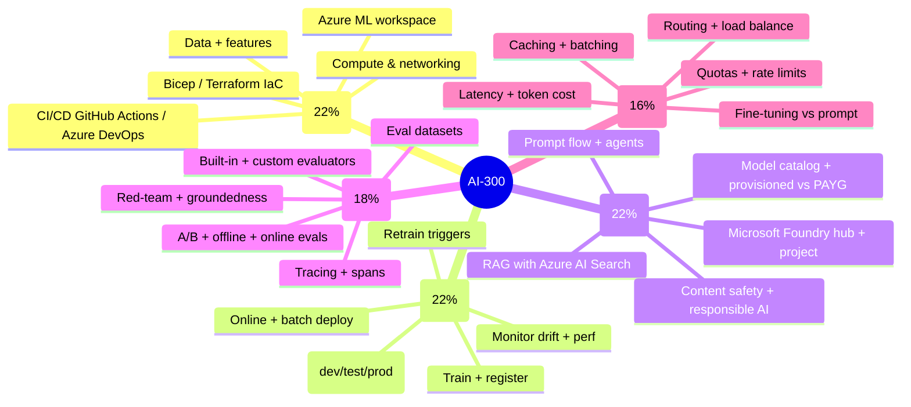
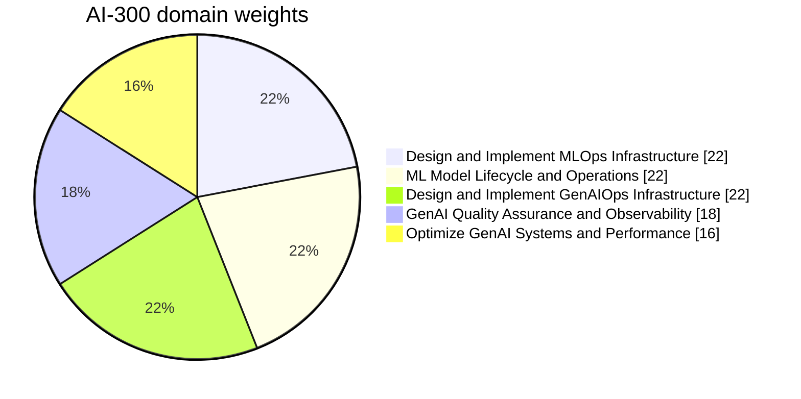
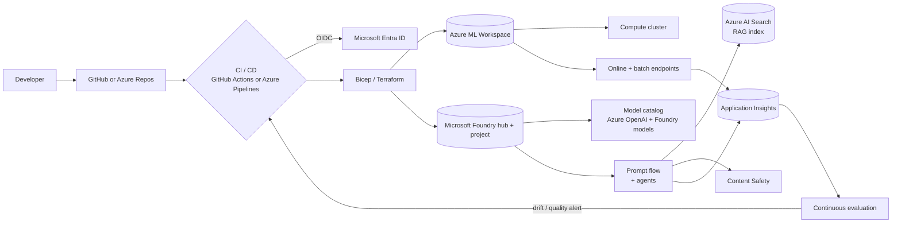
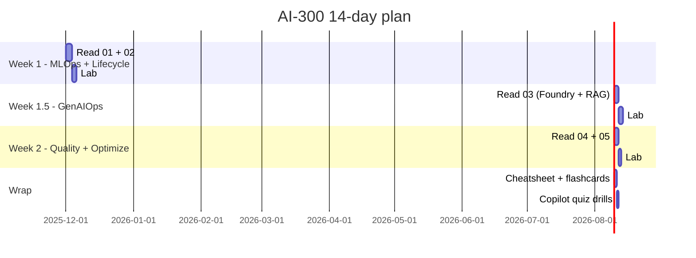

# AI-300 - Operationalizing Machine Learning and Generative AI Solutions - Visual Study Guide

> Concept-only study aid. No exam questions reproduced. Source PDF (if any) stays local + gitignored. **AI-300 is a beta exam** - Microsoft has not released an official practice assessment yet.

**Skills outline:** <https://aka.ms/AI300-StudyGuide>

---

## How to use this guide

1. Start at this page; click any sidebar entry on the left.
2. **Domain pages 01-05** carry the deep diagrams + decision trees + tables.
3. **Cheatsheet (05)** is the night-before reference.
4. **Extra concepts (07)** + **Architectures (09)** consolidate cross-cutting patterns (MLOps + GenAIOps end-to-end).
5. **Pitfalls (14)** lists the top traps the beta items will probe.
6. **Copilot Quiz (17)** generates infinite practice questions from the official outline.

---

## Domain map

---

## Domain weights

---

## End-to-end service map

---

## 6 question patterns to recognize

| Pattern | Trigger words | Likely answer family |
|---|---|---|
| **MLOps infra design** | "design infra", "Bicep", "GitHub Actions", "promote across environments" | Azure ML + IaC + OIDC + environment promotion |
| **Model lifecycle** | "register", "deploy", "blue/green", "monitor", "retrain" | Model registry, online/batch endpoint, data collector, drift monitor |
| **GenAIOps infra** | "Foundry hub", "agent", "prompt flow", "RAG", "content safety" | Foundry project + AI Search + content safety + tracing |
| **GenAI quality** | "evaluator", "groundedness", "A/B", "red-team", "trace" | Built-in evals + custom evaluators + tracing in Foundry |
| **Optimize GenAI** | "latency", "tokens", "throughput", "cache", "fine-tune" | Provisioned throughput, caching, batch, model routing |
| **Responsible AI** | "fairness", "harm", "PII", "jailbreak", "groundedness" | Content Safety + RAI dashboard + groundedness eval |

---

## Magic-words translator (Microsoft phrasing -> service)

| If the question says... | Pick... |
|---|---|
| Predictable peak latency for chat | **Provisioned Throughput Units (PTU)** for Azure OpenAI |
| Cost-effective sporadic GenAI | **Standard (PAYG)** Azure OpenAI |
| "No infrastructure to manage" for ML training | **Serverless compute** |
| "Reusable training workflow" | **Pipeline + components** |
| "Without storing credentials" CI/CD | **OIDC / workload identity federation** |
| "Detect distribution shift" in inputs | **Data drift monitor** |
| "Measure response quality" GenAI | **Built-in evaluators** (groundedness, relevance, fluency, coherence) |
| "Simulated jailbreak" | **AI Red Teaming Agent / safety evaluators** |
| Internal-only enterprise data Q&A | **RAG with Azure AI Search** |
| "Test prompt variants safely" | **Prompt flow** + offline evaluation runs |
| Tracing across agent steps | **Foundry tracing** (OpenTelemetry, App Insights) |
| Block harmful content at runtime | **Azure AI Content Safety** filters |
| Low-latency multi-region GenAI | **Load balancer + multiple deployments** (round-robin or weighted) |
| Cheaper inference for known prompts | **Prompt caching** or **provisioned reservations** |

---

## 14-day study plan

---

## Beta exam reminders

- **No public retired-question dump** - rely on the skills outline + Microsoft Learn.
- **No official Microsoft practice assessment yet** - use [Copilot Quiz](17-copilot-quiz.md) for infinite practice.
- Score is **delayed** ~10 days after testing window closes (standard for beta).
- Heavily weighted toward **GenAIOps** (60%+ when you sum domains 3, 4, 5).

---

[Sidebar: pick a domain to begin ->]
