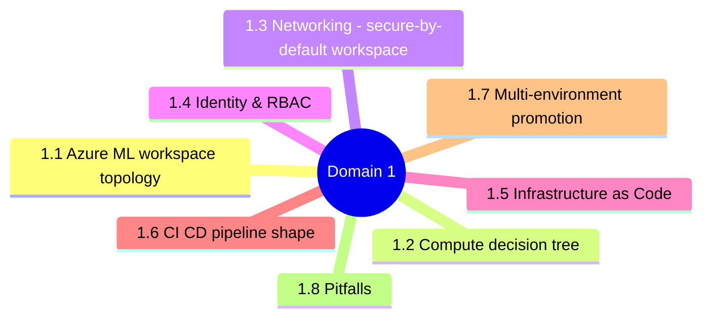
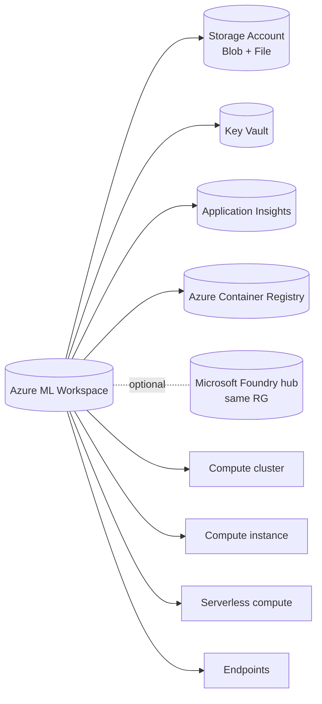
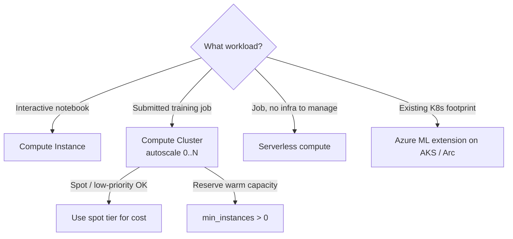
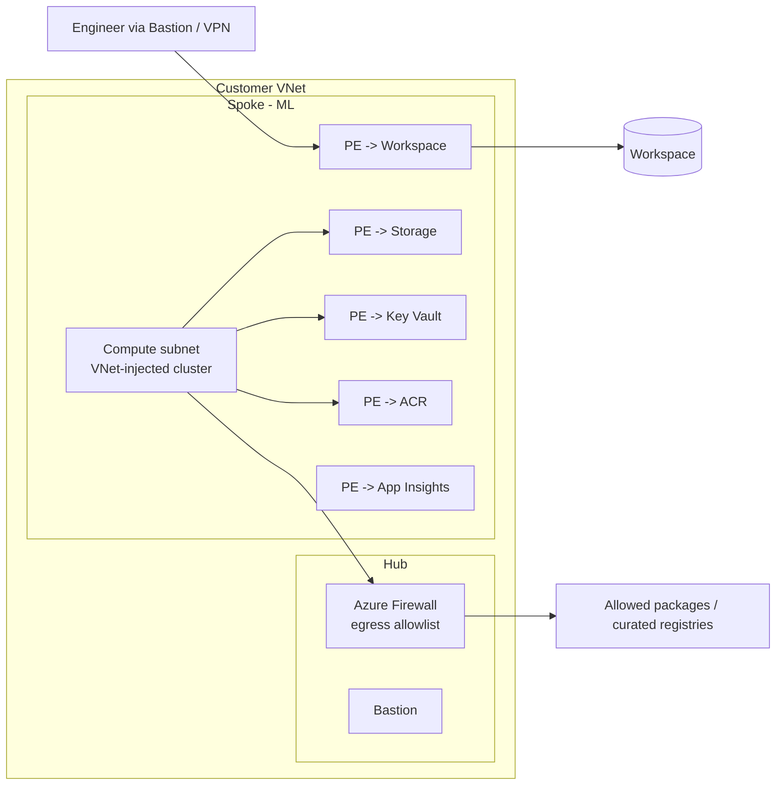
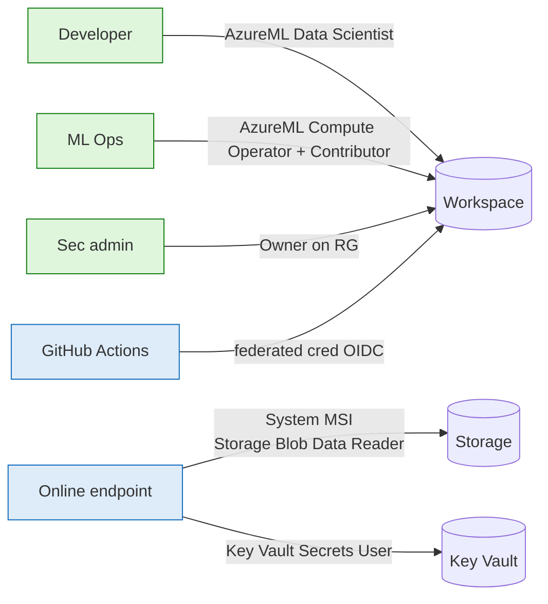
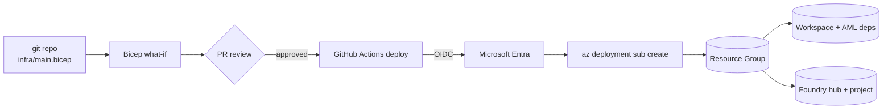
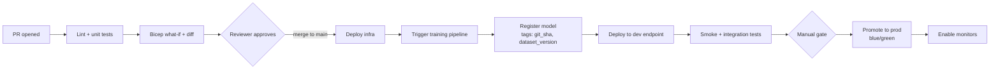
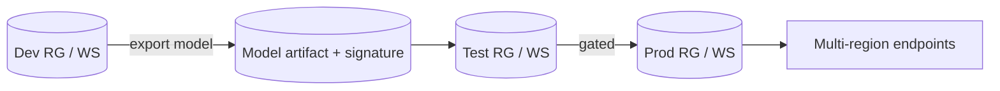

# Domain 1 - Design and Implement MLOps Infrastructure (22%)

> Build the workspace, networking, identity, IaC, and CI/CD foundation that all model lifecycle operations sit on.

---


## Domain mind map



## 1.1 Azure ML workspace topology



> An **Azure ML workspace** is the top-level container; **Foundry hub** is its GenAI-aware sibling. Many AI-300 scenarios deploy both side-by-side.

---

## 1.2 Compute decision tree



| Compute | Min nodes | Autoscale | Best for |
|---|---|---|---|
| Compute instance | 1 (always on) | No | Single-user authoring |
| Compute cluster | 0 -> N | Yes | Submitted jobs, sweep, pipelines |
| Serverless | 0 -> N | Yes (managed) | Job-by-job, no cluster mgmt |
| Kubernetes (AKS/Arc) | Per node pool | Per node pool | Hybrid / on-prem / GPU sharing |

---

## 1.3 Networking - secure-by-default workspace



Required toggles:

| Setting | Value |
|---|---|
| `public_network_access_enabled` (workspace) | `false` |
| Storage **public network access** | Disabled (selected networks) |
| ACR **SKU** | Premium (private endpoint requires) |
| Compute **VNet injection** | `subnet_id` set |
| Outbound rules | Managed VNet OR Firewall allowlist |

---

## 1.4 Identity & RBAC



Built-in roles cheat sheet:

| Role | Scope | Use for |
|---|---|---|
| **AzureML Data Scientist** | Workspace | Submit jobs, register models, deploy endpoints; **cannot** create compute |
| **AzureML Compute Operator** | Workspace / compute | Manage compute clusters & instances |
| **Reader** | RG / sub | View only |
| **Contributor** | RG | Provision via IaC |
| **Owner** | RG / sub | Add role assignments |

---

## 1.5 Infrastructure as Code



Modules to know:

- `Microsoft.MachineLearningServices/workspaces`
- `Microsoft.MachineLearningServices/workspaces/computes`
- `Microsoft.MachineLearningServices/workspaces/onlineEndpoints`
- `Microsoft.CognitiveServices/accounts` (Azure OpenAI / Foundry)
- `Microsoft.MachineLearningServices/workspaces/connections` (datastores, hub->AOAI)

> Prefer **Azure Verified Modules (AVM)** over hand-rolled.

---

## 1.6 CI/CD pipeline shape



GitHub Actions OIDC pieces:

```yaml
# .github/workflows/deploy.yml
permissions:
  id-token: write
  contents: read
jobs:
  deploy:
    runs-on: ubuntu-latest
    steps:
      - uses: azure/login@v2
        with:
          client-id: ${{ secrets.AZURE_CLIENT_ID }}
          tenant-id: ${{ secrets.AZURE_TENANT_ID }}
          subscription-id: ${{ secrets.AZURE_SUBSCRIPTION_ID }}
      - run: az ml online-endpoint create -f endpoint.yml
```

> No client secret stored. The federated credential maps `repo:org/repo:ref:refs/heads/main` -> service principal.

---

## 1.7 Multi-environment promotion



- **Workspace per env** (dev / test / prod) is the recommended pattern.
- Promote **registered models** (not training code) across environments via cross-workspace references or model export/import.
- IaC + `azd env` or Terraform workspaces handle the per-env wiring.

---

## 1.8 Pitfalls

1. Workspace + storage in **different regions** -> egress cost + latency.
2. **Public workspace** but private compute -> exposes the control plane.
3. Stored client secrets in CI/CD -> use **OIDC**.
4. Owner role on data scientists -> use **AzureML Data Scientist**.
5. ACR Basic SKU -> no private endpoint support.
6. Compute cluster `min_instances > 0` left running -> cost spike.
7. No **diagnostic settings** on workspace -> no audit trail.

---

[<- Master Index](00-MASTER-INDEX.md) - [Domain 2 ->](02-ml-model-lifecycle-and-operations.md)
