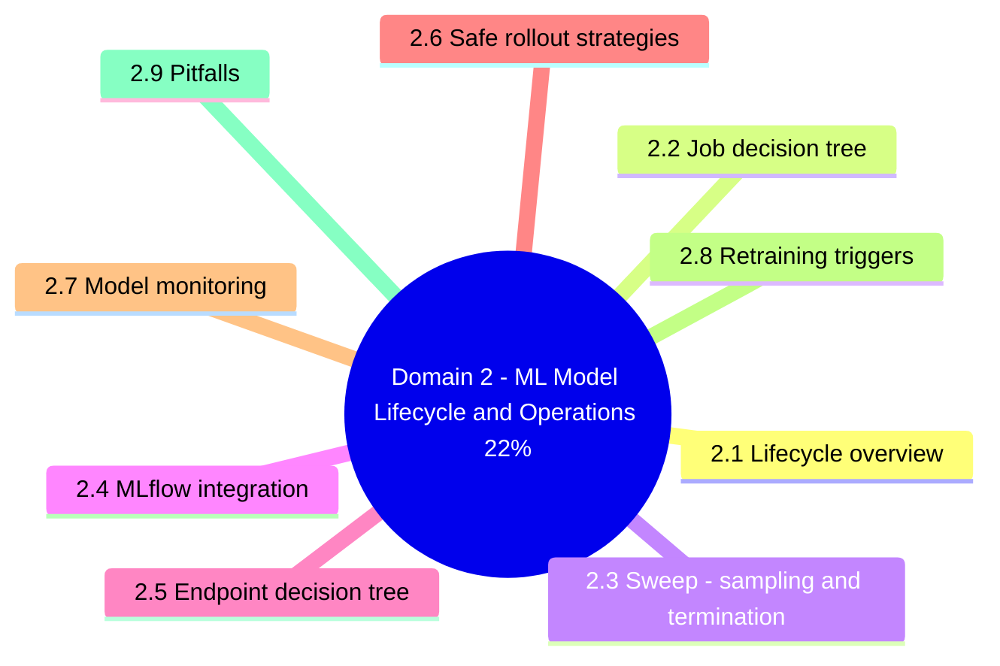
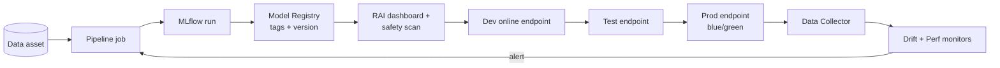
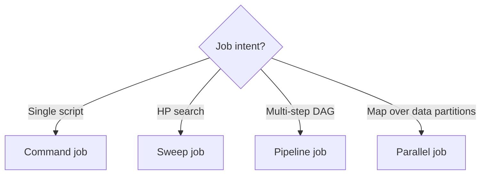
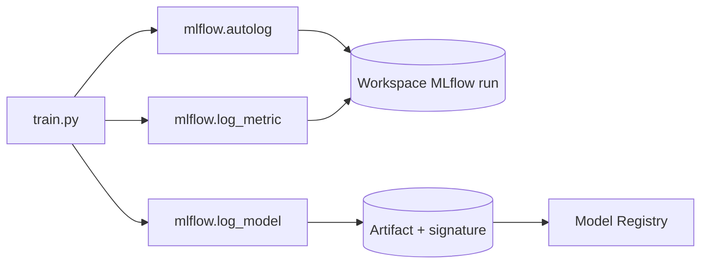
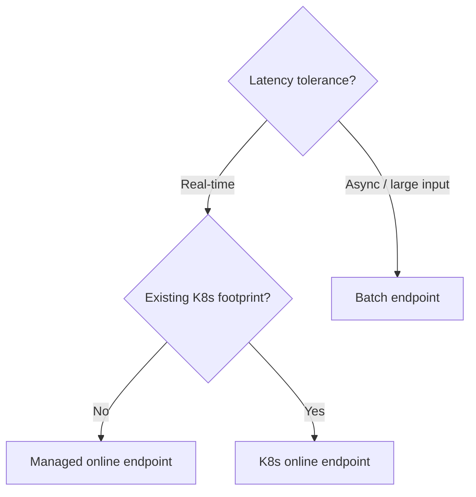
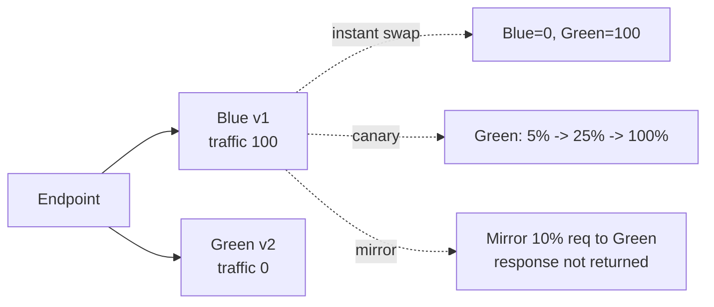
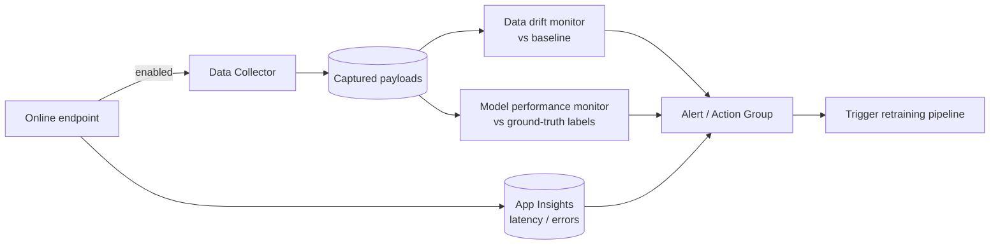

# Domain 2 - ML Model Lifecycle and Operations (22%)

> Train -> register -> deploy -> monitor -> retrain. The classic MLOps loop, with AI-300-flavored detail on data collector, drift, and gated rollouts.

---


## Domain mind map



## 2.1 Lifecycle overview



---

## 2.2 Job decision tree



| Type | YAML `type` | Use when |
|---|---|---|
| Command | `command` | One script, one set of args |
| Sweep | `sweep` | Tune HPs over a search space |
| Pipeline | `pipeline` | DAG of components |
| Parallel | `parallel` | Score / process huge datasets |

---

## 2.3 Sweep - sampling and termination

| Sampling | Continuous | Discrete | Early-term OK? |
|---|---|---|---|
| **Grid** | No | Yes | Yes |
| **Random** | Yes | Yes | Yes |
| **Bayesian** | Yes | Yes | **No** (must run to completion) |

| Policy | Behavior |
|---|---|
| **Bandit** | Kill if outside `slack_factor` of best |
| **Median Stopping** | Kill below running median |
| **Truncation Selection** | Drop bottom N% each interval |
| (none - Bayesian) | Let every trial finish |

---

## 2.4 MLflow integration



Two model flavors at registration:

- `mlflow_model` - has signature + conda env -> **no-code online deploy** y
- `custom_model` - opaque files -> requires **scoring script + env**

---

## 2.5 Endpoint decision tree



| Endpoint | Latency | Compute | Auth |
|---|---|---|---|
| Managed online | Low | Microsoft-managed VMs | key, AML token, Microsoft Entra |
| K8s online | Low | Your AKS / Arc | key, token |
| Batch | Async | Compute cluster | key, Microsoft Entra |

---

## 2.6 Safe rollout strategies



| Strategy | Risk | Use when |
|---|---|---|
| **Instant swap** | High | Hotfix only |
| **Canary** | Medium | Normal model upgrade |
| **Mirror** | Lowest | Validate against prod traffic without impact (<=50%) |

---

## 2.7 Model monitoring



| Signal | Source | Threshold |
|---|---|---|
| Feature drift | Data collector + baseline dataset | Wasserstein / PSI |
| Prediction drift | Outputs vs baseline | Distribution shift |
| Model performance | Joined ground-truth | Accuracy / RMSE drop |
| Latency / error rate | App Insights | P95 ms / 5xx rate |

---

## 2.8 Retraining triggers

```mermaid
flowchart TD
    T[Retraining triggers]
    T --> S[Schedule (daily/weekly)]
    T --> D[Drift alert]
    T --> P[Performance alert]
    T --> M[Manual re-run]
    T --> E[New data event]
```

> Use **schedule + drift** together. Schedule guarantees freshness; drift catches sudden shifts.

---

## 2.9 Pitfalls

1. Forgot `goal: maximize` on sweep primary metric -> picks worst run.
2. Bayesian sampling + Bandit policy -> invalid combo.
3. `custom_model` registered without scoring script -> deploy fails.
4. Mirror traffic > 50% -> not allowed.
5. Drift monitor without Data Collector enabled -> no data, no signal.
6. Model perf monitor without ground-truth ingestion -> never fires.
7. Online endpoint with fixed instances -> over- or under-provisioned.

---

[<- Domain 1](01-design-mlops-infrastructure.md) - [<- Master Index](00-MASTER-INDEX.md) - [Domain 3 ->](03-design-genaiops-infrastructure.md)
