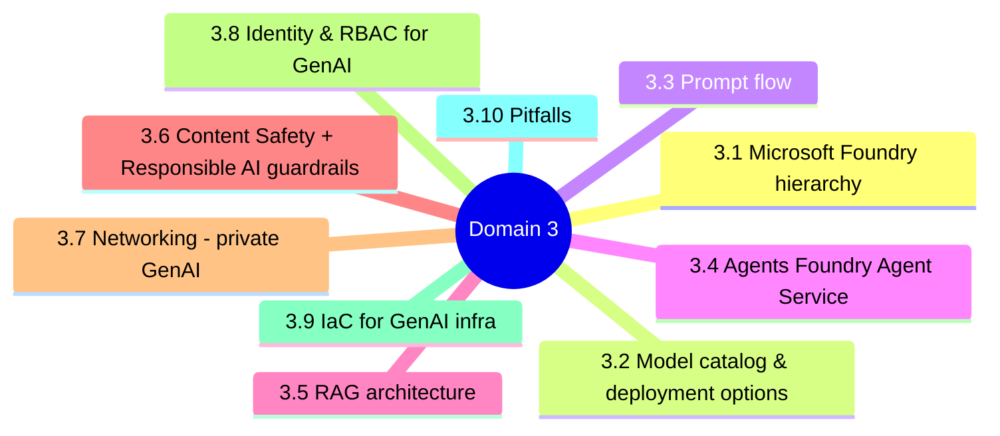
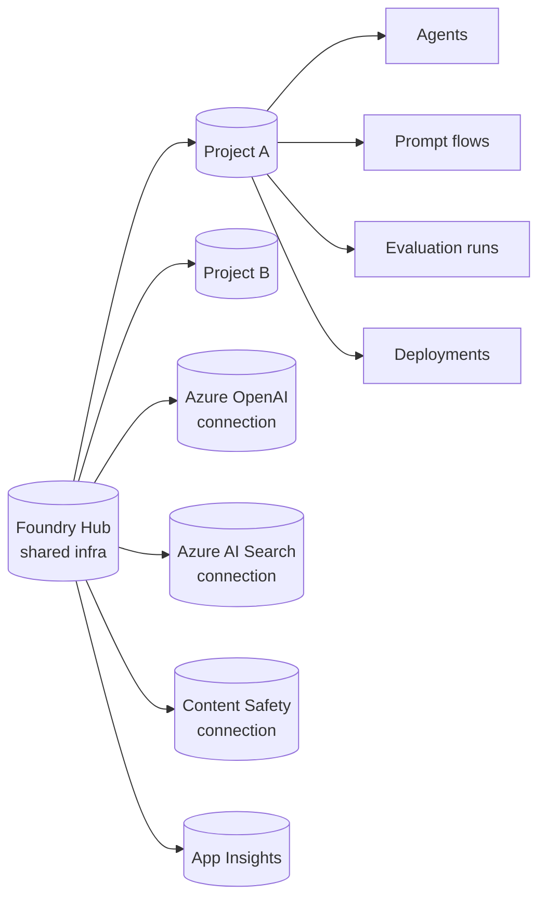
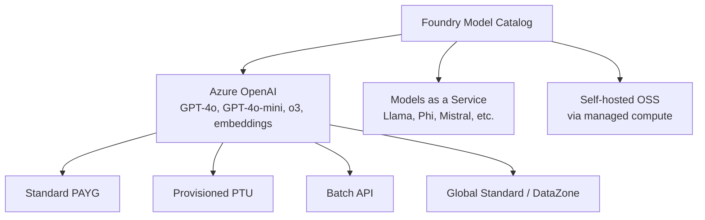
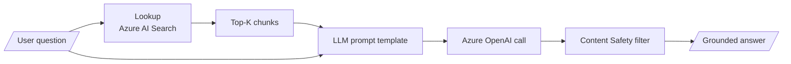
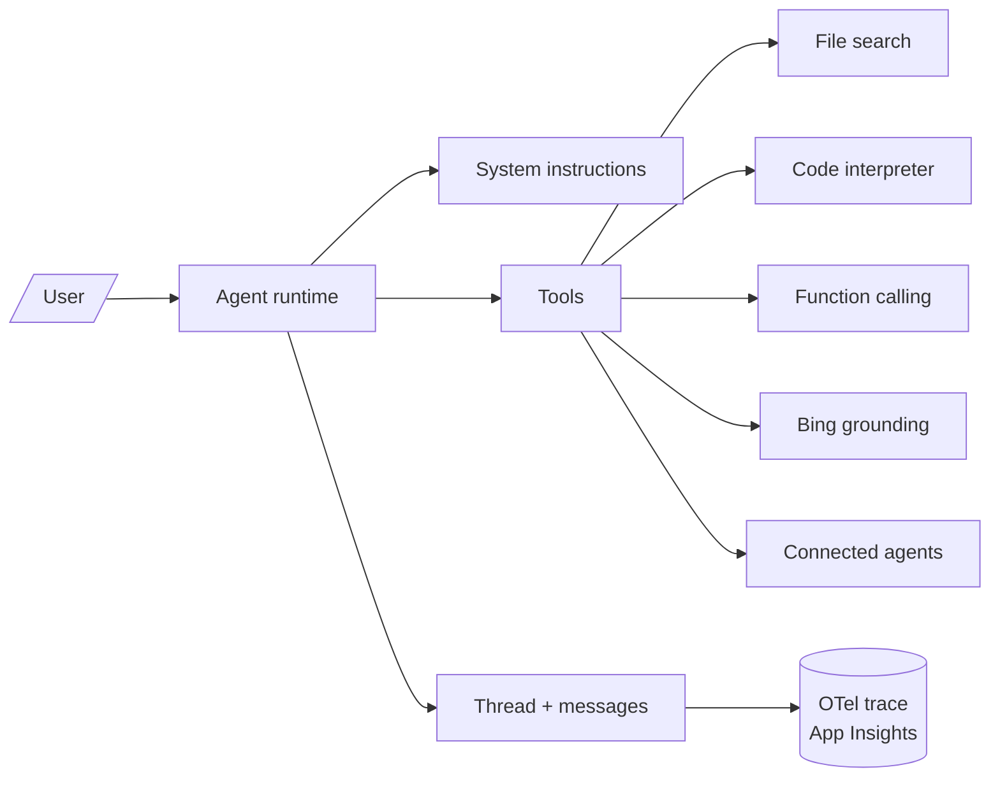
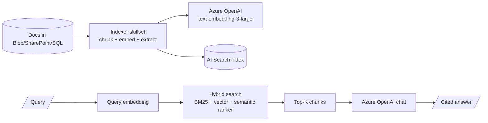
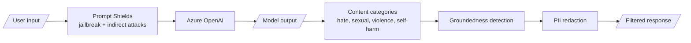
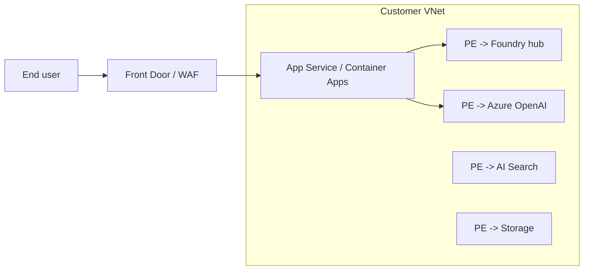

# Domain 3 - Design and Implement GenAIOps Infrastructure (22%)

> Microsoft Foundry hub + project, model catalog, prompt flow, agents, RAG with Azure AI Search, Content Safety, and the GenAI deployment topology.

---


## Domain mind map



## 3.1 Microsoft Foundry hierarchy



| Resource | Scope | Holds |
|---|---|---|
| **Hub** | Shared (often per BU/team) | Connections, key vault, storage, app insights, policy |
| **Project** | Per app/agent | Flows, agents, indexes, eval runs, deployments |
| **Connection** | Hub or project | Auth + endpoint to AOAI / Search / Storage / 3rd party |

---

## 3.2 Model catalog & deployment options



| Deployment SKU | Pay model | Latency | Use when |
|---|---|---|---|
| **Standard (PAYG)** | per token | Variable | Dev, low/intermittent traffic |
| **Provisioned (PTU)** | per PTU/hr | Predictable | Prod, peak traffic, SLA |
| **Batch** | 50% off | Async (24h) | Bulk offline workloads |
| **Global Standard** | per token | Lowest p50 | Geo-distributed |
| **DataZone Standard** | per token | Region-bound | EU/US data residency |

---

## 3.3 Prompt flow



> **Prompt flow** = a DAG of nodes (Python, LLM, prompt, lookup) with versioning, batch runs, and offline evaluation.

Node types:

- `python` - arbitrary code
- `prompt` - Jinja template
- `llm` - Azure OpenAI / serverless model call
- `index_lookup` - vector / hybrid retrieval

---

## 3.4 Agents (Foundry Agent Service)



Multi-agent: a **connected agent** is exposed as a tool to a parent agent.

---

## 3.5 RAG architecture



Retrieval modes:

| Mode | Cost | Quality |
|---|---|---|
| Keyword (BM25) | Lowest | Baseline |
| Vector | Medium | Better recall |
| Hybrid | Medium | Best general |
| Hybrid + Semantic Ranker | Higher | Highest (re-rank) |

Index sizing knobs: chunk size (~500-1500 tokens), overlap (~10-20%), embedding dim (1024/3072), partition count, replica count.

---

## 3.6 Content Safety + Responsible AI guardrails



Configurable filter levels per category: `low / medium / high`. Built into AOAI deployments by default; **Content Safety standalone** when you need custom blocklists or independent endpoints.

---

## 3.7 Networking - private GenAI



Required toggles for private:

- AOAI: `publicNetworkAccess: Disabled`, `networkAcls.defaultAction: Deny`, **system MSI** for AI Search/Storage access
- AI Search: private endpoint + `publicNetworkAccess: Disabled`, `Search Index Data Reader` to AOAI
- Foundry hub: managed VNet OR customer-VNet PE

---

## 3.8 Identity & RBAC for GenAI

| Identity | Needs role | On |
|---|---|---|
| App backend MSI | `Azure AI Inference User` (or `Cognitive Services User`) | AOAI / Foundry project |
| Indexer MSI | `Storage Blob Data Reader` | Source storage |
| AOAI deployment MSI | `Search Index Data Reader` | AI Search |
| AOAI deployment MSI | `Storage Blob Data Reader` | Source blob (for "On Your Data") |
| Developer | `Azure AI Developer` | Foundry project |

---

## 3.9 IaC for GenAI infra

```bicep
resource hub 'Microsoft.MachineLearningServices/workspaces@2024-10-01' = {
  name: hubName
  kind: 'Hub'
  properties: { publicNetworkAccess: 'Disabled' }
}
resource project 'Microsoft.MachineLearningServices/workspaces@2024-10-01' = {
  name: projectName
  kind: 'Project'
  properties: { hubResourceId: hub.id }
}
resource aoai 'Microsoft.CognitiveServices/accounts@2024-10-01' = {
  kind: 'OpenAI'
  sku: { name: 'S0' }
  properties: { publicNetworkAccess: 'Disabled' }
}
```

---

## 3.10 Pitfalls

1. Putting all projects in one hub but ignoring **per-project quota** -> noisy-neighbor token throttling.
2. Standard (PAYG) for prod chat at peak -> 429s; switch to **PTU**.
3. RAG with vector-only and no semantic ranker -> weak ordering of chunks.
4. Indexer storage but no MSI grant -> indexer fails silently after rotation.
5. Disabled public network on AOAI but app calling via public endpoint -> DNS / connectivity failure (use private DNS zones).
6. Not enabling **App Insights** on the project -> no tracing.
7. Forgetting `Cognitive Services OpenAI User` role on caller MSI -> 401s with cryptic messages.

---

[<- Domain 2](02-ml-model-lifecycle-and-operations.md) - [<- Master Index](00-MASTER-INDEX.md) - [Domain 4 ->](04-genai-quality-and-observability.md)
