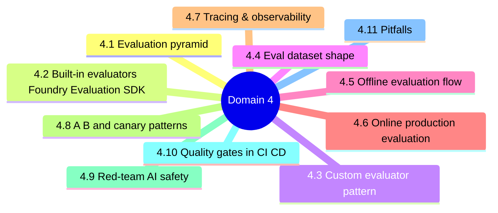
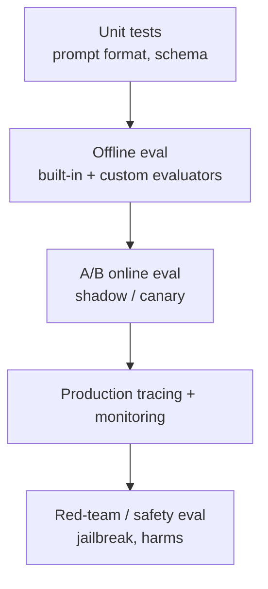
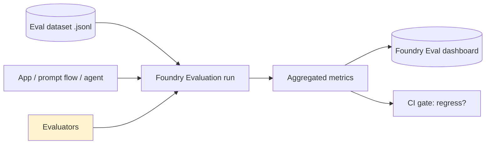
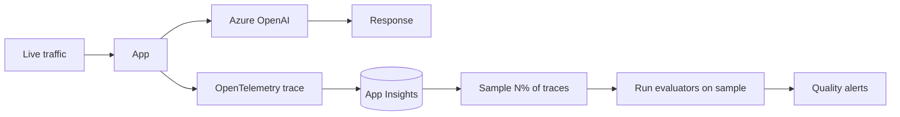
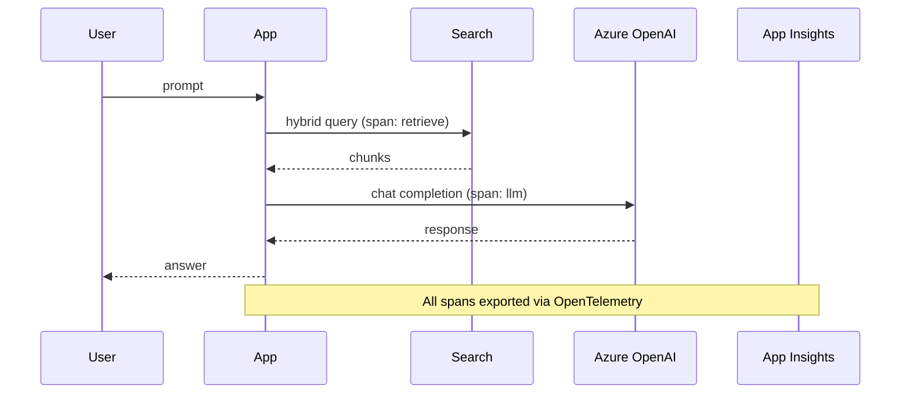
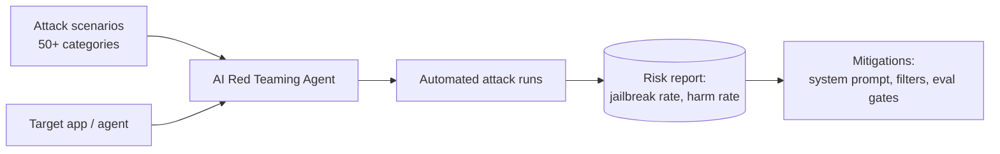

# Domain 4 - GenAI Quality Assurance and Observability (18%)

> Evaluate, trace, monitor, and red-team GenAI workloads. Built-in evaluators + custom evaluators + offline + online + safety.

---


## Domain mind map



## 4.1 Evaluation pyramid



---

## 4.2 Built-in evaluators (Foundry Evaluation SDK)

| Category | Evaluator | What it measures |
|---|---|---|
| **Quality** | `RelevanceEvaluator` | Answer relevance to question |
| **Quality** | `CoherenceEvaluator` | Logical flow |
| **Quality** | `FluencyEvaluator` | Grammar / readability |
| **Quality** | `GroundednessEvaluator` | Answer supported by retrieved context (RAG) |
| **Quality** | `SimilarityEvaluator` | vs golden answer |
| **Risk/safety** | `ContentSafetyEvaluator` | hate, sexual, violence, self-harm |
| **Risk/safety** | `ProtectedMaterialEvaluator` | Copyright leakage |
| **Risk/safety** | `IndirectAttackEvaluator` | XPIA (cross-prompt injection) |
| **Risk/safety** | `CodeVulnerabilityEvaluator` | Vulnerable code generation |
| **Performance** | `ResponseLatencyEvaluator` | p50 / p95 latency |

---

## 4.3 Custom evaluator pattern

```python
from azure.ai.evaluation import evaluate

def my_eval(query, response, **kwargs):
    return {"acceptable": "PII" not in response}

result = evaluate(
    data="testset.jsonl",
    target=my_app,
    evaluators={"pii_check": my_eval},
)
```

> A custom evaluator is **any Python callable** that returns a dict. Use it for domain rules (e.g. "must cite at least one source", "must mention disclaimer").

---

## 4.4 Eval dataset shape

```jsonl
{"query": "...", "context": "...", "ground_truth": "...", "expected_intent": "..."}
```

| Field | Required for |
|---|---|
| `query` | All |
| `context` | Groundedness, Relevance |
| `ground_truth` | Similarity, custom QA |
| `response` | Outputs (filled by target call) |

---

## 4.5 Offline evaluation flow



---

## 4.6 Online (production) evaluation



> Continuously sample real traffic (e.g. 5%) and run evaluators offline against the sample. Alerts when groundedness or content-safety scores drop.

---

## 4.7 Tracing & observability



Foundry tracing automatically captures:

- Inputs/outputs per node
- Token usage + latency per LLM call
- Tool invocations (agents)
- Eval results when wired to a flow

---

## 4.8 A/B and canary patterns

| Pattern | Mechanism | Risk |
|---|---|---|
| **Shadow** | Mirror traffic to challenger, don't return | Lowest |
| **Canary** | 5% -> 25% -> 100% | Medium |
| **Champion / challenger** | Two endpoints, route by policy | Medium |
| **Blue/green** | Instant 0<->100 swap | High |

---

## 4.9 Red-team / AI safety



Categories: prompt injection, jailbreak, ungrounded hallucination, harmful content, PII leakage, copyright, dangerous code, biased outputs.

---

## 4.10 Quality gates in CI/CD

```yaml
# evaluate before promote
- name: Evaluate
  run: az ml evaluation create -f eval.yml
- name: Gate on regression
  run: |
    python check_metrics.py \
      --groundedness-min 0.85 \
      --safety-violation-max 0.01
```

> Block promotion if any built-in safety evaluator regresses.

---

## 4.11 Pitfalls

1. Tracing not enabled (no App Insights connection on project) -> blind spot.
2. Groundedness eval without `context` field -> returns null.
3. Running evals against prod-only data without **golden set** -> drift in baselines.
4. Sampling 100% of prod traffic for online eval -> cost explosion.
5. Skipping red-team before launch -> compliance risk.
6. Custom evaluator returns `True/False` instead of dict -> SDK error.
7. Eval cluster is too small -> eval runs queue forever.

---

[<- Domain 3](03-design-genaiops-infrastructure.md) - [<- Master Index](00-MASTER-INDEX.md) - [Domain 5 ->](05-optimize-genai-systems.md)
