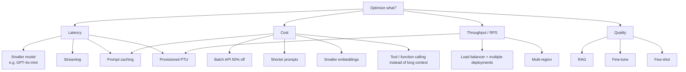
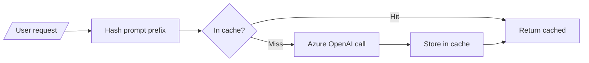
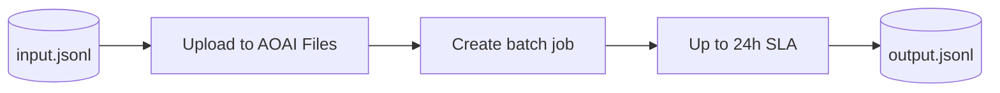
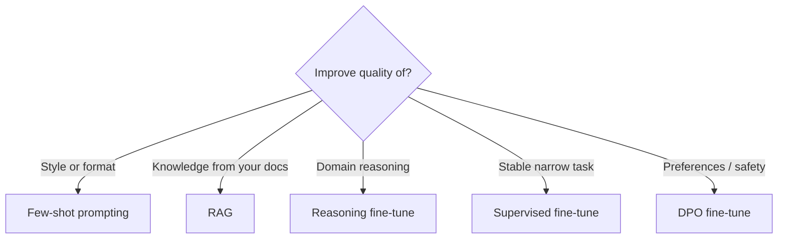
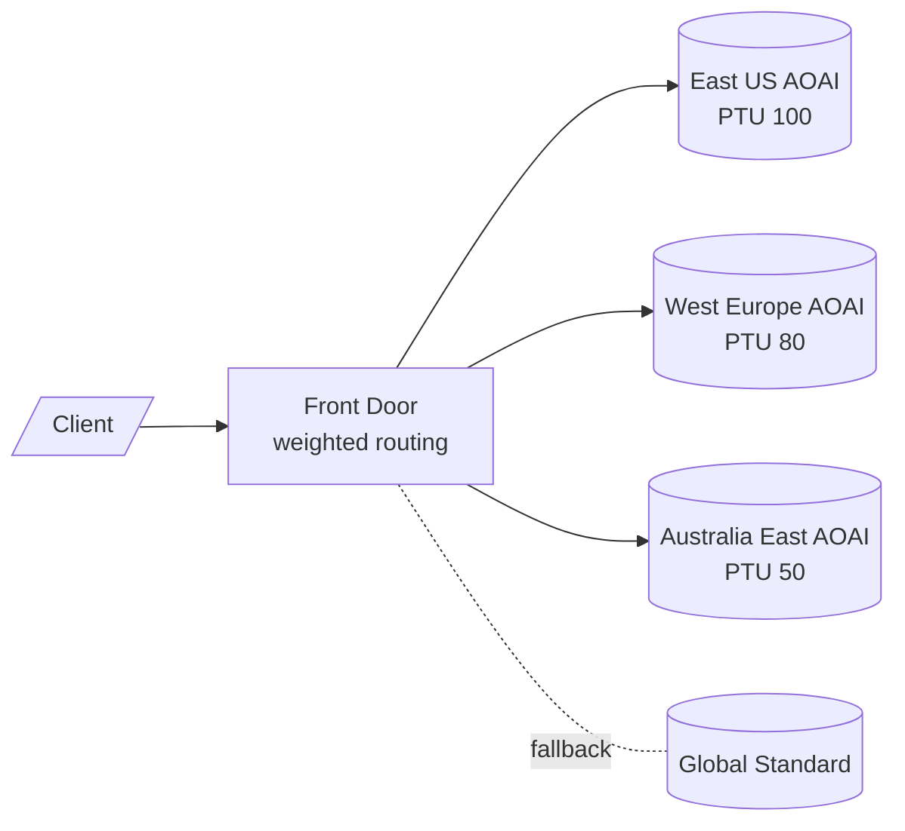

# Domain 5 - Optimize GenAI Systems and Performance (16%)

> Latency, throughput, token cost, capacity, fine-tuning vs prompting, caching, multi-model routing.

---

## 5.1 Cost & latency knobs

---

## 5.2 Provisioned vs PAYG

| | **Standard (PAYG)** | **Provisioned (PTU)** |
|---|---|---|
| Pricing | per 1K tokens in/out | per PTU/hour |
| Latency | Variable | Predictable / SLO-able |
| Capacity | Shared | Reserved |
| Throttling | 429 frequent at peak | None (within PTU budget) |
| Use when | Dev, sporadic prod | High-RPS prod, SLA |

> PTU calc: minimum 50 PTU for `gpt-4o`; use the [capacity calculator](https://learn.microsoft.com/azure/ai-services/openai/how-to/provisioned-throughput-onboarding) before commit.

---

## 5.3 Prompt caching

Two flavors:

- **AOAI native prompt caching** - automatic for repeated prefixes >=1024 tokens (`gpt-4o`, `o3` family). Up to **50% latency reduction** on cached portions.
- **App-level cache** (Redis / Azure API Management semantic cache) - dedup for **repeated queries**, not just prefixes.

---

## 5.4 Batch API

- 50% cheaper than synchronous calls.
- Use for: bulk classification, embeddings backfill, offline summarization.
- **Not** for interactive UX.

---

## 5.5 Fine-tuning vs prompting decision

| Method | Cost | Latency impact | When to choose |
|---|---|---|---|
| Few-shot | Low | None | Small set of examples |
| RAG | Medium | +retrieval | Up-to-date, citable |
| SFT | Medium-high | None at inference | Repetitive narrow task |
| DPO | High | None at inference | Align preferences |
| RFT (o-series) | Highest | None | Multi-step reasoning |

---

## 5.6 Multi-region routing

- Use **Front Door** or **APIM** to route by user region or by health.
- Pair regional **PTU** with a **Global Standard** fallback for burst.

---

## 5.7 APIM as AI Gateway

| Capability | Purpose |
|---|---|
| Token rate limiting | Per-subscription quota |
| Semantic caching | Cache by embedding similarity |
| Load balancing | Round-robin / weighted across deployments |
| Backend pooling | Failover among regions |
| PII redaction | Pre-call mask |
| Logging to App Insights | Metering, audit |

---

## 5.8 Reducing tokens

- **Tool/function calling** beats stuffing JSON schemas in the prompt.
- For embeddings, `text-embedding-3-small` 1536-dim is cheaper than `large` 3072-dim with often comparable retrieval quality.
- Set max retrieved chunks (Top-K) to 3-5, not 20.

---

## 5.9 Quotas & rate limits

| Limit | Where |
|---|---|
| TPM (tokens per minute) | Per AOAI deployment |
| RPM (requests per minute) | Per AOAI deployment |
| PTU | Per provisioned deployment |
| Global tenant cap | Across all AOAI deployments |
| Search query QPS | Per AI Search service tier |

> **429 strategy:** retry with exponential backoff + jitter; rotate across multiple deployments via APIM.

---

## 5.10 Pitfalls

1. PTU bought for `gpt-4o` then used to call `gpt-4o-mini` -> no PTU benefit.
2. Cache key = full prompt -> very low hit rate; cache **prefix** only.
3. Batch API for chat UX -> users see 24h delay.
4. Fine-tuning to add knowledge -> use **RAG** instead.
5. Long system prompts repeated every call -> break into cached prefix + small variable suffix.
6. No retry policy -> 429 -> user-facing 500.
7. Fixed instance count on online endpoint -> either over- or under-provisioned at peak.

---

[<- Domain 4](04-genai-quality-and-observability.md) - [<- Master Index](00-MASTER-INDEX.md)
