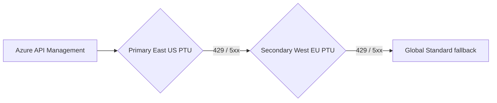
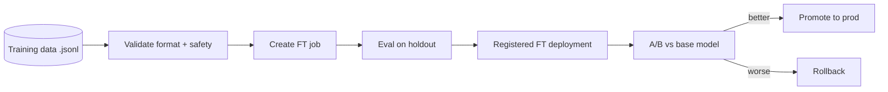

# Extra Concepts - AI-300

> Cross-cutting topics not slotted into a single domain.

---

## E1. MLOps maturity ladder for GenAI

| Level | Signals |
|---|---|
| L0 - ad hoc | Notebooks, manual deploys, no versioning |
| L1 - reproducible | Git + IaC + pipeline jobs |
| L2 - automated | CI/CD on every PR, model registry, smoke tests |
| L3 - observed | Tracing + evaluators + drift monitors |
| L4 - self-healing | Auto-retrain on drift, auto-rollback on regression |

> AI-300 expects you to design **L3** at minimum.

---

## E2. Data residency patterns

| Need | Pick |
|---|---|
| Single region, low latency | Regional Standard |
| EU-only or US-only | DataZone Standard |
| Lowest p50, no residency | Global Standard |
| Sovereignty + private | Regional Standard + private endpoints |

---

## E3. Token economics formula

```
cost_per_call ~ (input_tokens x $/1K_in) + (output_tokens x $/1K_out)
PTU_throughput ~ PTU_count x tokens_per_PTU_per_minute
```

Levers (in order of impact):

1. **Model choice** (`gpt-4o-mini` ~ 1/15 cost of `gpt-4o`)
2. **Prompt cache hit rate** (50% off cached prefix tokens)
3. **Batch API** (50% off, async)
4. **Top-K reduction**
5. **Embedding dimension** (small vs large)
6. **System prompt length**

---

## E4. RAG quality checklist

- [ ] Hybrid search (BM25 + vector) enabled
- [ ] Semantic ranker turned on (Standard tier+)
- [ ] Chunk size 500-1500 tokens, 10-20% overlap
- [ ] Top-K = 3-5 (not 20)
- [ ] Citations included in prompt template
- [ ] Groundedness evaluator scoring >= 0.85 baseline
- [ ] Indexer scheduled and uses MSI
- [ ] System prompt instructs "answer only from context"

---

## E5. Agent design patterns

| Pattern | When |
|---|---|
| **Single agent + tools** | Most use cases |
| **Connected agents** | Specialist sub-agents (e.g. SQL agent + RAG agent) |
| **Orchestrator + workers** | Long-horizon planning |
| **Reflective loop** | Agent critiques own output before returning |

---

## E6. Multi-region GenAI failover



Failover priorities: latency -> cost -> availability.

---

## E7. Common identity wiring (cookbook)

```bicep
// App backend MSI calling AOAI
resource role 'Microsoft.Authorization/roleAssignments@2022-04-01' = {
  scope: aoai
  name: guid(app.id, aoai.id, 'aoai-user')
  properties: {
    principalId: app.identity.principalId
    roleDefinitionId: subscriptionResourceId(
      'Microsoft.Authorization/roleDefinitions',
      '5e0bd9bd-7b93-4f28-af87-19fc36ad61bd' // Cognitive Services OpenAI User
    )
  }
}
```

---

## E8. Azure ML SDK v2 vs v1

| Concept | v1 | v2 |
|---|---|---|
| Entry point | `Workspace.from_config()` | `MLClient(...)` |
| Datasets | `Dataset.File / Tabular` | `Data` asset (uri_file / uri_folder / mltable) |
| Compute | `ComputeTarget` | YAML `compute:` reference |
| Pipeline | Python class | YAML + components |
| Model | `Model.register()` | `MLClient.models.create_or_update(Model(...))` |
| CLI | `az ml ...` (v1) | `az ml ...` (v2 - `extension v2`) |

> AI-300 is **SDK v2 / CLI v2 only**.

---

## E9. Prompt flow vs Agent - when

| Need | Pick |
|---|---|
| Deterministic DAG, easy to evaluate offline | Prompt flow |
| Multi-turn tool use, planning | Agent |
| Both - production app | Agent that calls a prompt flow as a tool |

---

## E10. Fine-tuning operational pattern



> Always evaluate FT model with the same evaluator suite as the base.

---

[<- Master Index](00-MASTER-INDEX.md)
