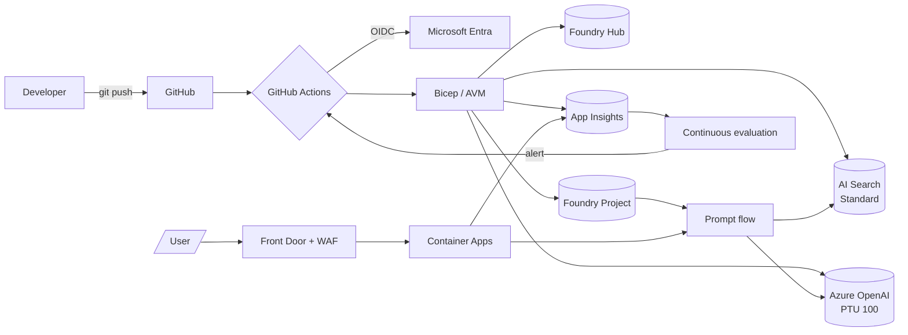
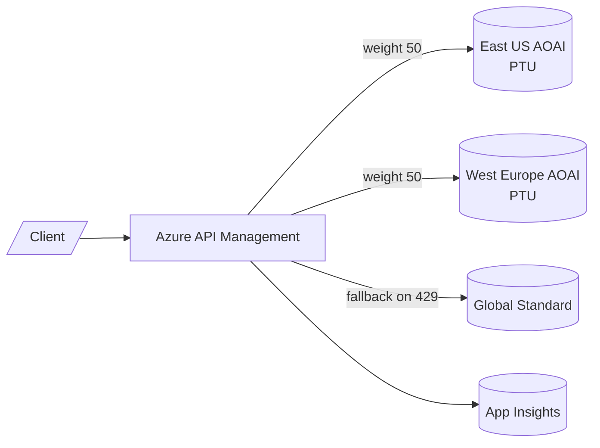
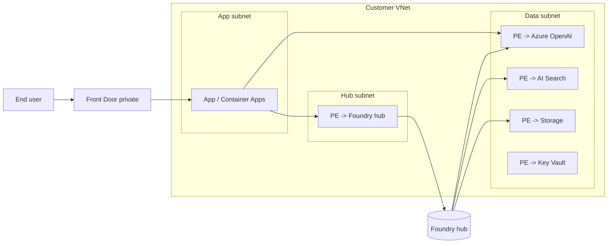
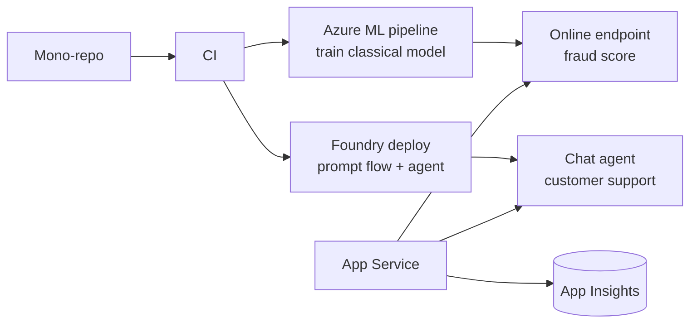
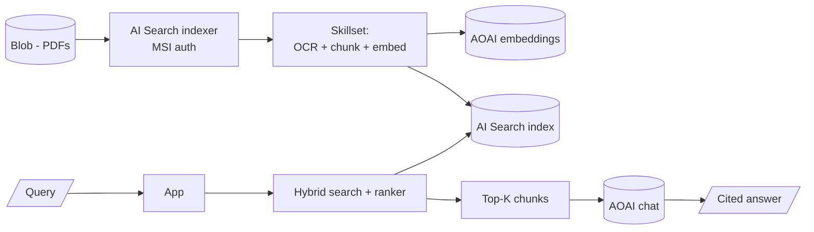
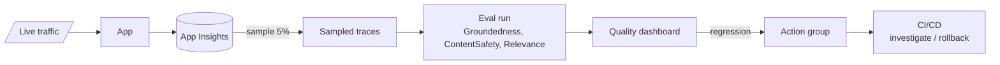
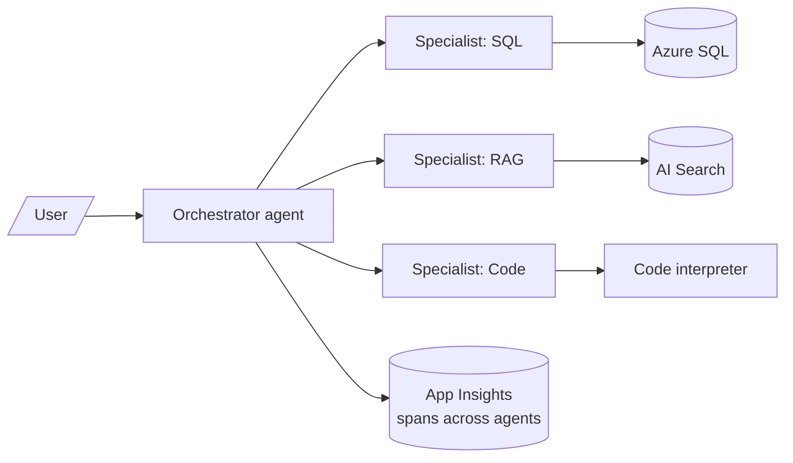

# Architectures - AI-300

> Reference architectures combining MLOps + GenAIOps.

---

## 1. End-to-end GenAIOps with RAG

---

## 2. Multi-region PTU with global fallback

> APIM applies token rate-limit, semantic cache, and PII redaction policies before backend dispatch.

---

## 3. Network-isolated Foundry

---

## 4. Hybrid MLOps + GenAIOps

---

## 5. RAG with private indexer

---

## 6. Continuous evaluation loop

---

## 7. Multi-agent system

---

[<- Master Index](00-MASTER-INDEX.md)
